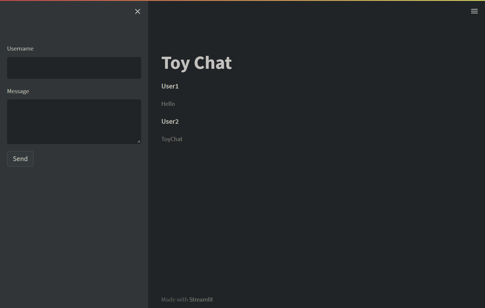

# Toy Chat

Standalone chat application with Streamlit



## install

```bash
pip install -U pip
pip install -r requirements.txt
```

## run

```bash
streamlit run ToyChat.py
```

access http://localhost:8501 with browser.
